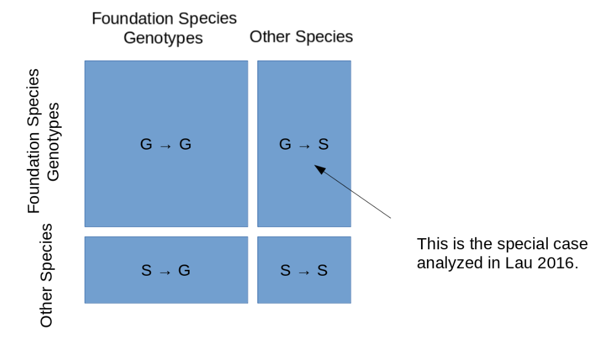

# Summary


# Notebook

## Fri 30 Oct 2020 02:28:22 PM EDT

- Given a network of species ($n$) with uniform genotypic richness ($g$)
  we would calculate the number of individuals ($m$) to be equal to
  $ng$. 
- If the graph is regular, the number of vertices ($v$), then the
  degree of the graph $deg(G)$ can be calculated as $m(k - 1)$, where $k$ is
  the degree of each node. 
- Using these assumptions, we can calculate the scaling of the graph
  degree in response to variation in the genotypic richness, assuming
  each node is the maximum degree.
  
  
```{r degG-by-g, eval = TRUE, cache = TRUE, fig.width = 7, fig.height = 7}

n <-  10
g  <- seq(1, 1000)
dG <- n * g * (n * g - 1)
plot(dG~g, type = "l", 
     xlab = "Genotype Richness (g)", 
     ylab = "Network Degree (deg G)")
lines(range(g), range(dG), col = "grey")
lines(range(g), range(g), col = "grey")

```

We can expand this to variation in the node degree mainting a regular
graph. 

```{R degG-g-k, eval = TRUE, cache = TRUE, fig.width = 7, fig.height = 7}

min.v <- n * g * 1/10
med.v <- n * g * 1/2
max.v <- n * g
dg.min <- n * g * (min.v - 1)
dg.med <- n * g * (med.v - 1)
dg.max <- n * g * (max.v - 1)

plot(dg.max ~ g, type = "l", 
     xlab = "Genotype Richness (g)", 
     ylab = "Network Degree (deg G)")
lines(g, dg.med, lty = 2)
lines(g, dg.min, lty = 3)
lines(range(g), range(dG), col = "grey")
lines(range(g), range(g), col = "grey")

```

- It would appear that for a regular graph, the scaling of the degree is
super-linear, exponential as long as the graph is regular and the
addition of genotypes results in the addition of a proportionate
number of vertices (i.e. interactions). 
- This could be expanded to explore different network structures, such
as centralized, modular, nested, etc. 
- The nested structure would be particularly interesting, as genotype
  communities are likely subsets of the larger community [@Lau2016a].
- This could be done via formulations of the degree distribution,
	e.g. $P(k) = \frac{n_k}{n}$ for a regular network or
	Erdos-Renyi/Random, Scale-Free, Small-World, etc.
- Could also explore other metrics.




# References

<div id="refs"></div>
