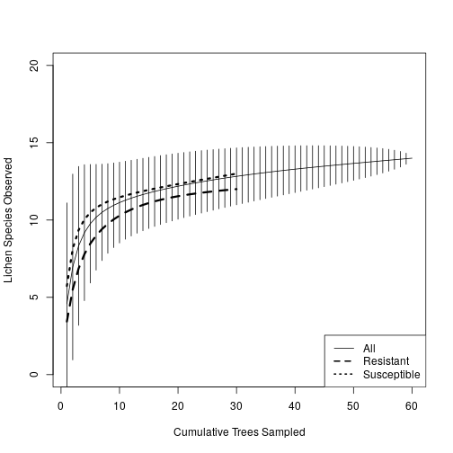
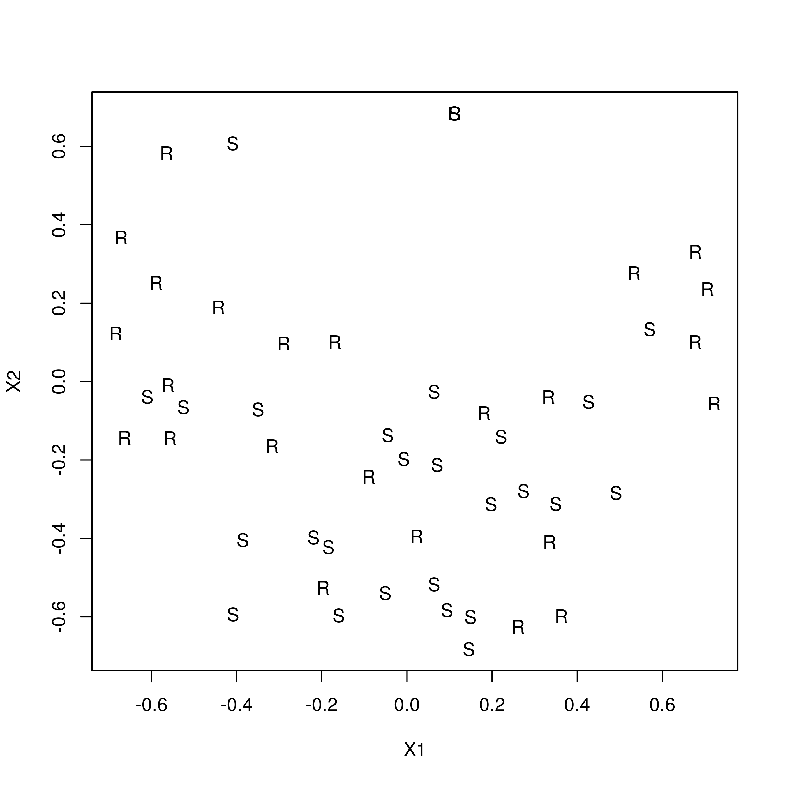

# Analysis Summary

- Dead trees and non-lichen species were removed from lichen community
  analyses. 
- Lichen communities were adequately sampled, based on species
  accumulation curves, with moth resistant trees accumulating slightly
  more lichen species.
- Lichen communities (abundance, richness, diversity, composition)
were significantly, generally negatively, affected by moth
susceptibility.
- Several tree variables, including light availability, leaf litter
  abundance and rock abundance, were impacted by moth susceptibility.
- Analysis of causal pathways supported an indirect link between moth
  susceptibility and impacts on lichen communities via decreasing rock
  (i.e. habitat) availability through increased leaf abscission and
  accumulation on rocks under trees.
- These results support a genetically based link between intraspecific
  variation in susceptibility to an insect herbivore and community
  dynamics in an arid ecosystem.
- Given the possible impacts of cliimate change on this system, this
  study supports the conclusion that community and ecosystem impacts
  need to be considered in an evolutionary context.


```r
# 0. Supporting functions and libraries
## Support functions

dif <- function(x){
    out=x[1]
    for (i in 2:length(x)){
        out=out-x[i]
    }
    return(out)
}

## Libraries
my.libs <- c("vegan", "ecodist", "knitr", "kableExtra")
if (any(!(my.libs %in% installed.packages()[, 1]))){
    sapply(my.libs[!(my.libs %in% installed.packages()[, 1])], 
           install.packages)
}else{}
```

```
## Installing package into '/home/glomus/R/x86_64-pc-linux-gnu-library/3.6'
## (as 'lib' is unspecified)
```

```
## also installing the dependencies 'rvest', 'webshot'
```

```r
sapply(my.libs, require, character.only = TRUE)
```

```
## Loading required package: vegan
```

```
## Loading required package: permute
```

```
## Loading required package: lattice
```

```
## This is vegan 2.5-6
```

```
## Loading required package: ecodist
```

```
## 
## Attaching package: 'ecodist'
```

```
## The following object is masked from 'package:vegan':
## 
##     mantel
```

```
## Loading required package: kableExtra
```

# Load Data


The following are variable descriptions (Variable, Type, Range, Definition):

    

- Moth,categorical,0 or 1,Was the tree susceptible (0) or resistant (1) to moth attack?
- Live/Dead,categorical,0 or 1,Was the tree dead (0) or alive (1)?
- Litter %,continuous,0 to 100,Percent cover inside quadrat
- Rocks > 3cm? %,continuous,0 to 100,Percent cover of rocks > 3cm? inside quadrat
- Rocks < 3cm? %,continuous,0 to 100,Percent cover of rocks < 3cm? inside quadrat
- Shrubs %,continuous,0 to 100,Percent cover of shrubs inside quadrat
- Grass %,continuous,0 to 100,Percent cover of grass inside quadrat
- Branches %,continuous,0 to 100,Percent cover of branches on ground inside quadrat
- Distance,continuous,0 to 100,"Distance from main trunk, converted to percent of crown radius at that azimuth"
- Azimuth,continuous,0 to 360,Compass direction from main trunk
- Slope,continuous,0 to 90,Topographical steepness
- Aspect,continuous,0 to 360,Compass direction of slope
- Light,continuous,,Amount of light available to epiliths


```r
## Data are in ../data/scrl
l.dat <- read.csv("../data/scrl/spp_env_combined.csv")

## Summary of data
summary(l.dat)

## remove dead trees
l.dat <- l.dat[l.dat[, "Live.Dead"] != 0, ]

## Lichen species list
spp.l <- c("Acacon", "Acasup", "Acaobp", "Sterile.sp", "Brown.cr",
"Lobalp", "Canros", "Calare", "Phydub", "Rhichr", "Xanlin", "Xanpli",
"Xanele", "GrBr.cr", "Gray.cr")
spp.moss <- c("Synrur", "Cerpur.Bryarg")

## Create a community matrix
com <- l.dat[, colnames(l.dat) %in% spp.l]
com.moss <- l.dat[, colnames(l.dat) %in% spp.moss]

## Add the tree labels to the rownames
rownames(com) <- paste(l.dat[, "Moth"], l.dat[, "Tree.pairs"], sep = "_")
rownames(com.moss) <- paste(l.dat[, "Moth"], l.dat[, "Tree.pairs"], sep = "_")
rownames(l.dat) <- paste(l.dat[, "Moth"], l.dat[, "Tree.pairs"], sep = "_")
```


# Species accumulation

Are the communities on each tree type adequately sampled?


```r
spa.all <- specaccum(com)
spa.res <- specaccum(com[l.dat[, "Moth"] == 0, ])
spa.sus <- specaccum(com[l.dat[, "Moth"] == 1, ])

plot(spa.all,
     ylim = c(0, 20),
     xlab = "Cumulative Trees Sampled",
     ylab = "Lichen Species Observed")
lines(spa.res$sites, spa.res$richness, 
      ylim = c(0, 20), lty = 2, lwd = 3)
lines(spa.sus$sites, spa.sus$richness, 
      ylim = c(0, 20), lty = 3, lwd = 3)
legend("bottomright", 
       legend = c("All", "Resistant", "Susceptible"), 
       lty = c(1, 2, 3), lwd = c(1, 2, 2))
```



# Moth trees have different microenvironments 

- paired t-tests 

# Moth trees have different lichen communities (FIGURE ch.plot A, R, H) 

less abundant and diverse (paired t-tests, in text) 


```r
abun <- apply(com, 1, sum)
rich <- apply(com, 1, function(x) sum(sign(x)))
shan <- apply(com, 1, diversity, index = "shannon")
tt.a <- t.test(tapply(abun, l.dat[, "Tree.pairs"], diff))
tt.r <- t.test(tapply(rich, l.dat[, "Tree.pairs"], diff))
tt.h <- t.test(tapply(shan, l.dat[, "Tree.pairs"], diff))
tt.arh <- do.call(rbind, 
                  list(a = unlist(tt.a), r = unlist(tt.r), h = unlist(tt.h)))
data.frame(tt.arh)
```

```
##         statistic.t parameter.df             p.value          conf.int1
## a -2.35680534636893           29  0.0253991007560338  -2.89259563276878
## r -2.83579994251995           29 0.00824742800912123  -3.95880113980294
## h -2.43278934693583           29  0.0213834528180339 -0.783514237345595
##             conf.int2 estimate.mean.of.x null.value.mean            stderr
## a  -0.204737700564558  -1.54866666666667               0 0.657104189386137
## r  -0.641198860197056               -2.3               0 0.811058624239964
## h -0.0678109108683953 -0.425662574106995               0 0.174968940341312
##   alternative            method                                 data.name
## a   two.sided One Sample t-test tapply(abun, l.dat[, "Tree.pairs"], diff)
## r   two.sided One Sample t-test tapply(rich, l.dat[, "Tree.pairs"], diff)
## h   two.sided One Sample t-test tapply(shan, l.dat[, "Tree.pairs"], diff)
```

composition is different (PERMANOVA, in text and supplement)


```r
com.ds <- cbind(com, ds = rep(0.0001, nrow(com)))
set.seed(123)
ptab.moth <- adonis2(com.ds~ Moth, data = l.dat, 
                    strata = l.dat[, "Tree.pairs"], 
                    by = "margin", nperm = 100000)
kable(ptab.moth)
```

<table>
 <thead>
  <tr>
   <th style="text-align:left;">   </th>
   <th style="text-align:right;"> Df </th>
   <th style="text-align:right;"> SumOfSqs </th>
   <th style="text-align:right;"> R2 </th>
   <th style="text-align:right;"> F </th>
   <th style="text-align:right;"> Pr(&gt;F) </th>
  </tr>
 </thead>
<tbody>
  <tr>
   <td style="text-align:left;"> Moth </td>
   <td style="text-align:right;"> 1 </td>
   <td style="text-align:right;"> 0.8281197 </td>
   <td style="text-align:right;"> 0.0389381 </td>
   <td style="text-align:right;"> 2.349914 </td>
   <td style="text-align:right;"> 0.023 </td>
  </tr>
  <tr>
   <td style="text-align:left;"> Residual </td>
   <td style="text-align:right;"> 58 </td>
   <td style="text-align:right;"> 20.4394472 </td>
   <td style="text-align:right;"> 0.9610619 </td>
   <td style="text-align:right;"> NA </td>
   <td style="text-align:right;"> NA </td>
  </tr>
  <tr>
   <td style="text-align:left;"> Total </td>
   <td style="text-align:right;"> 59 </td>
   <td style="text-align:right;"> 21.2675669 </td>
   <td style="text-align:right;"> 1.0000000 </td>
   <td style="text-align:right;"> NA </td>
   <td style="text-align:right;"> NA </td>
  </tr>
</tbody>
</table>

three main species were reduced by moths (FDR paired t-tests, in text + supplement)


```r
ind.spp <- lapply(com, function(x, p) t.test(tapply(x, p, diff)), p = l.dat[, "Tree.pairs"])
isp <- apply(do.call(rbind, lapply(ind.spp, unlist)), 2, as.numeric)
```

```
## Warning in apply(do.call(rbind, lapply(ind.spp, unlist)), 2, as.numeric): NAs
## introduced by coercion

## Warning in apply(do.call(rbind, lapply(ind.spp, unlist)), 2, as.numeric): NAs
## introduced by coercion

## Warning in apply(do.call(rbind, lapply(ind.spp, unlist)), 2, as.numeric): NAs
## introduced by coercion
```

```r
rownames(isp) <- names(ind.spp)
isp[, "p.value"] <- p.adjust(isp[, "p.value"], method = "fdr")
isp <- isp[order(isp[, "p.value"]), ]
head(isp[, 1:3])
```

```
##        statistic.t parameter.df    p.value
## Acacon   -3.377629           29 0.01390405
## Acasup   -3.242091           29 0.01390405
## Canros   -3.581884           29 0.01390405
## Lobalp   -2.041361           29 0.17642430
## Phydub   -1.922619           29 0.18031798
## Calare   -1.607607           29 0.22424946
```

# Litter covering rocks was the main driver (FIGURE = ORDINATION)

light not litter predicted lichen composition (PERMANOVA, table 3, Ordination)


```r
set.seed(123)
ptab.env <- adonis2(com.ds ~  Light...average + Litter.., data = l.dat, 
                   strata = l.dat[, "Tree.pairs"],  
                   by = "margin", nperm = 100000)
kable(ptab.env)
```

<table>
 <thead>
  <tr>
   <th style="text-align:left;">   </th>
   <th style="text-align:right;"> Df </th>
   <th style="text-align:right;"> SumOfSqs </th>
   <th style="text-align:right;"> R2 </th>
   <th style="text-align:right;"> F </th>
   <th style="text-align:right;"> Pr(&gt;F) </th>
  </tr>
 </thead>
<tbody>
  <tr>
   <td style="text-align:left;"> Light...average </td>
   <td style="text-align:right;"> 1 </td>
   <td style="text-align:right;"> 0.4114804 </td>
   <td style="text-align:right;"> 0.0193478 </td>
   <td style="text-align:right;"> 1.225652 </td>
   <td style="text-align:right;"> 0.240 </td>
  </tr>
  <tr>
   <td style="text-align:left;"> Litter.. </td>
   <td style="text-align:right;"> 1 </td>
   <td style="text-align:right;"> 1.0095951 </td>
   <td style="text-align:right;"> 0.0474711 </td>
   <td style="text-align:right;"> 3.007221 </td>
   <td style="text-align:right;"> 0.007 </td>
  </tr>
  <tr>
   <td style="text-align:left;"> Residual </td>
   <td style="text-align:right;"> 57 </td>
   <td style="text-align:right;"> 19.1362475 </td>
   <td style="text-align:right;"> 0.8997855 </td>
   <td style="text-align:right;"> NA </td>
   <td style="text-align:right;"> NA </td>
  </tr>
  <tr>
   <td style="text-align:left;"> Total </td>
   <td style="text-align:right;"> 59 </td>
   <td style="text-align:right;"> 21.2675669 </td>
   <td style="text-align:right;"> 1.0000000 </td>
   <td style="text-align:right;"> NA </td>
   <td style="text-align:right;"> NA </td>
  </tr>
</tbody>
</table>


```r
nmds.out <- nmds(vegdist(com.ds), 2, 2)
ord <- nmds.min(nmds.out, dims = 2)
```

```
## Minimum stress for given dimensionality:  0.2164016 
## r^2 for minimum stress configuration:  0.6474944
```

```r
ord.pch <- c("R", "S")[(l.dat[, "Moth"] + 1)]
plot(X2~ X1, data = ord, pch = ord.pch)
```



litter not light was correlated with large rocks (dist cor, in text)


```r
cor.test(tapply(l.dat[, "Big.rocks.."], l.dat[, "Tree.pairs"], diff),
         tapply(l.dat[, "Litter.."], l.dat[, "Tree.pairs"], diff))
```

```
## 
## 	Pearson's product-moment correlation
## 
## data:  tapply(l.dat[, "Big.rocks.."], l.dat[, "Tree.pairs"], diff) and tapply(l.dat[, "Litter.."], l.dat[, "Tree.pairs"], diff)
## t = -11.106, df = 28, p-value = 9.054e-12
## alternative hypothesis: true correlation is not equal to 0
## 95 percent confidence interval:
##  -0.9530598 -0.8039735
## sample estimates:
##        cor 
## -0.9027609
```

```r
cor.test(tapply(l.dat[, "Big.rocks.."], l.dat[, "Tree.pairs"], diff),
         tapply(l.dat[, "Light...average"], l.dat[, "Tree.pairs"], diff))
```

```
## 
## 	Pearson's product-moment correlation
## 
## data:  tapply(l.dat[, "Big.rocks.."], l.dat[, "Tree.pairs"], diff) and tapply(l.dat[, "Light...average"], l.dat[, "Tree.pairs"], diff)
## t = 0.71624, df = 28, p-value = 0.4798
## alternative hypothesis: true correlation is not equal to 0
## 95 percent confidence interval:
##  -0.2376184  0.4716125
## sample estimates:
##       cor 
## 0.1341335
```

